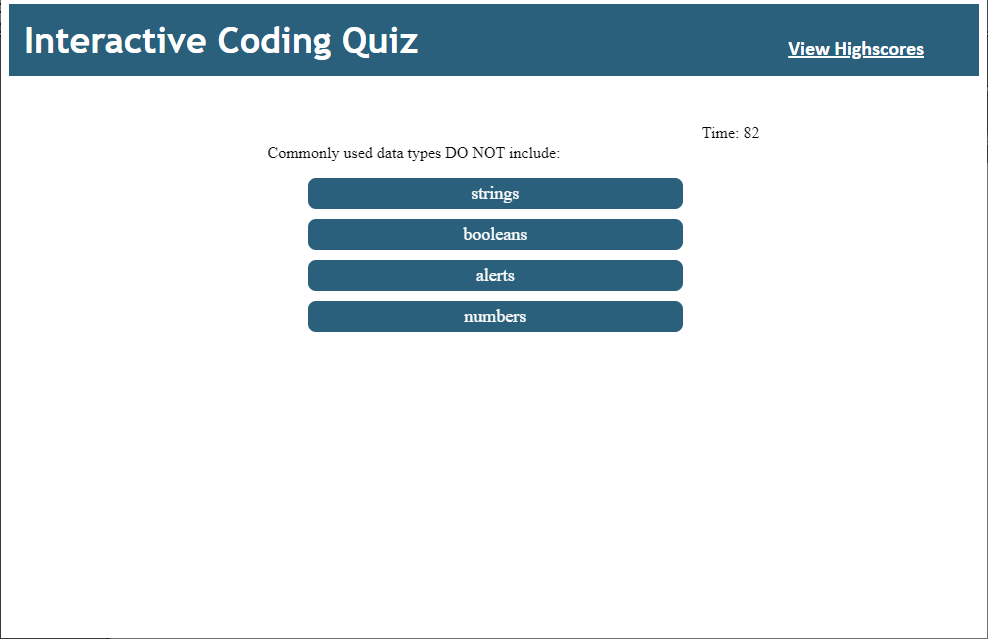
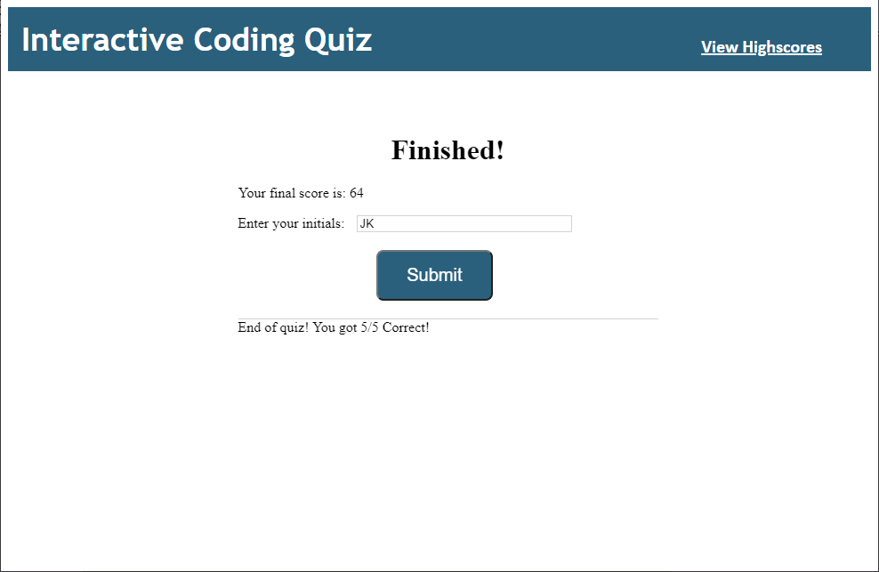
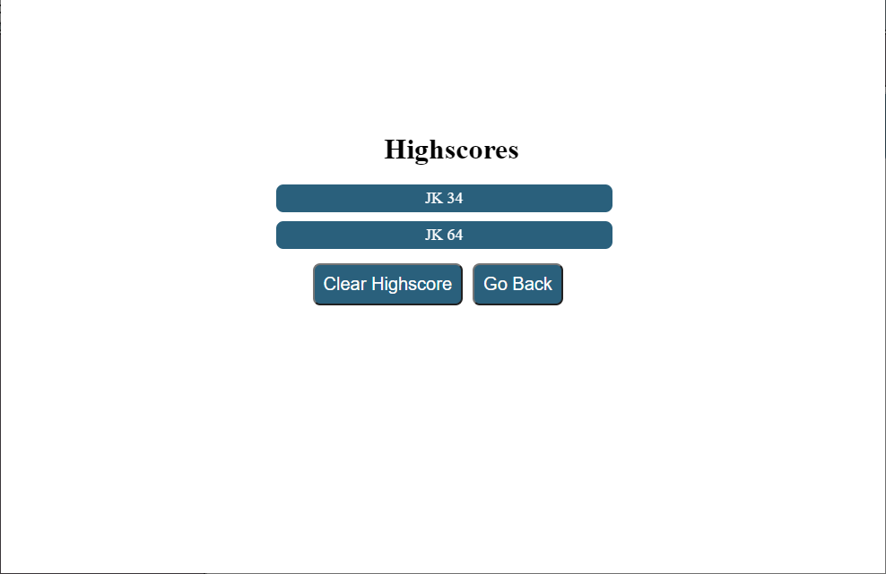

# interactive-coding-quiz

# <Interactive Coding Quiz>

## Description

This website presents a quiz to the user. Upon starting the quiz, the user must answer 5 multiple choice questions under a time limit, losing time if they answer a question incorrectly. After taking the quiz, the user is then prompted to enter their initials to post their score to a leaderboard, which is stores thier score in local storage. Upon refreshing the website, the scores will persist thanks to local storage.

---

## Screenshots

## Installation

In order to download and run this project, you may:

- Clone the repository through Git, then run the directory in Visual Studio Code. Afterwards, run index.html and launch through the web browser of your choice.
- Download the .zip of the repository, then extract it. Afterwards, open the folder through Visual Studio Code, or launch the index.html file directly.
- Alternatively, if you want to view only the website without having the files, you can view the website by following this link: https://jakekeebler.github.io/interactive-coding-quiz/

---

## Usage

Test your coding knowledge in this quick quiz and post your score to the leaderboard! 

---

## Credits

HTML/CSS/JS Code: Jared Keebler

---

## License

No license required.

---

